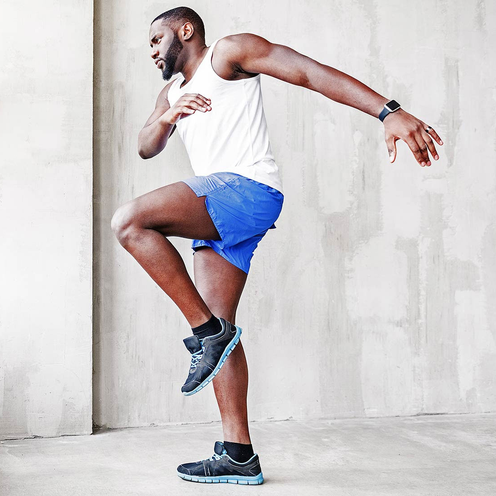

<!-- container -->
<main role="main" class="content-area">
  
  <!-- price packages section -->
    <section class="price-packages weight-lifing-outline-bg pt-4 pb-5">
      

        

          

            

              <h1><b>PRICE PACKAGES</b></h1>
              
choose package as per your requirements & needs.

            

          

        

        

          
            

              

                

                  <a href="{{program.link}}"
                    class="btn-style-2 btn-calculate d-inline-flex align-items-center justify-content-center">{{program.name}}</a>
                  

                    <h4>&pound;{{program.price}}/{{program.duration}}</h4>
                    
<a href={{program.link}} class="text-uppercase btn-style-1 text-white">Read More</a>

                  

                

              

            

          
        

      

    </section>
  <!-- // price packages section -->
  
  <!--follow us section-->
  <section class="follow-us">
    

      

        

          

            <h4 class="text-uppercase">FOLLOW ME</h4>
            <a class="text-uppercase" href="https://www.instagram.com/fitmannyuk/">@FITMANNYUK</a>
          

        

        

          

            <h4 class="text-uppercase">FITMANNY IN THE SPOTLIGHT</h4>
            <a class="text-uppercase" href="https://www.instagram.com/explore/tags/fitmannyuk/">#FITMANNYUK</a>
          

        

        

          

            <h1 class="text-uppercase">FIT-MANNY ARMY</h1>
          

        

      

    

    

      

        

        

        

        

        

        

        

        

        

          

        

        

        

        

        

        

        

        

        

        

        

        

        

        

        

        

      

      
    

  </section>
  <!--// follow us section-->
  
  
</main>
<!-- /.container -->
