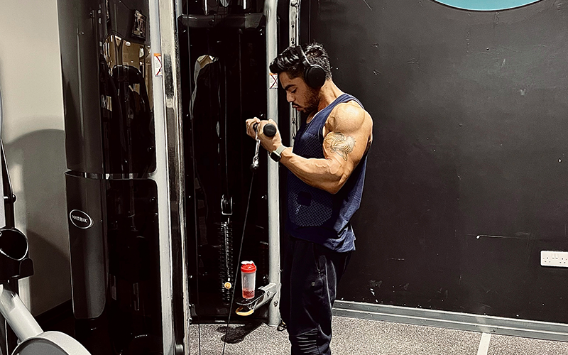

<main role="main" class="content-area blogdetailspage">
  <section class="new-blog weight-lifing-outline-bg py-5 py-md-5 py-sm-0">
    

      

        

          

            

              

                

                  

                    

                      <label class="mb-0">fitness</label>
                      
                    

                    <h1 class="mb-4">You will get these</h1>
                    
                      
<i class="fas fa-chevron-right"></i> {{detail}}

                    
                    

                      

                        

                      

                    

                  

                

              

            

          

          

            

              

                <h2 class="text-center line-through">&pound;{{programs[0].price}}/{{programs[0].duration}}</h2>
                <h1>&pound;{{programs[0].offer_price}}/{{programs[0].duration}}</h1>
              

            

            

              

                

                  

                    
                  

                

              

            

          

        

      

    

  </section>
  
  
</main>

